<!--
1. 이미지(가운데 정렬, 60%)
<center></center>

1-2. 이미지 캡션 달기
<p align = "center">
내용
</p>
-->
# 비선형 구조 - 트리 (Tree)
## Contents
 1. [비선형 구조란?](#비선형-구조란?)
 1. [비선형 자료 구조](#비선형-자료-구조)
1. [트리(Tree)](#트리(Tree))
    - [트리의 용어](#트리의-용어)
    - [트리의 분류](#트리의-분류)
1. [이진 트리(Binary Tree)](#이진-트리(Binary-Tree))
    - [이진 트리의 종류](#이진-트리의-종류)
    - [이진 트리의 표현](#이진-트리의-표현)
        - [배열을 이용한 표현](#배열을-이용한-표현)
        - [연결 리스트를 이용한 표현](#연결-리스트를-이용한-표현)
    - [이진 트리의 순회(Traversal)](#이진-트리의-순회(Traversal))
        - [전위(Preorder)순회](#전위(Preorder)순회)
        - [중위(Inorder)순회](#중위(Inorder)순회)
        - [후위(Postorder)](#후위(Postorder))
    - [이진 트리 순회 알고리즘](#이진-트리-순회-알고리즘)
        - [재귀 알고리즘을 사용한 이진 트리 순회](#재귀-알고리즘을-사용한-이진-트리-순회)
        - [반복 알고리즘을 사용한 이진 트리 순회](#반복-알고리즘을-사용한-이진-트리-순회)
    - [이진 탐색 트리(Binary Search Tree)](#이진-탐색-트리(Binary-Search-Tree))
        - [이진 탐색 트리의 탐색](#이진-탐색-트리의-탐색)
        - [이진 탐색 트리에서의 삽입](#이진-탐색-트리에서의-삽입)
        - [이진 탐색 트리에서의 삭제](#이진-탐색-트리에서의-삽입)

***
# 비선형 구조란?
- 자료의 순서가 불규칙한 성질을 지닌 자료를 표현하는데 적합하며 자료의 연결 관계가 한 개 이상의 형태를 지닌 복잡한 구조를 말한다
***

# 비선형 자료 구조
- `트리` : 계층적인 관계를 표현할 경우 사용하는 자료구조로, 그래프의 특수한 형태
- `그래프` : 객체 간의 다양한 연결 관계를 표현할 수 있는 자료구조이다
***
# 트리(Tree)
- 트리는 `노드(node)`라고 불리는 정점과
- 노드와 노드를 연결하는 `간선(edge)`으로 연결된 형태를 갖으며, 
- `사이클(Cycle)`이 형성되지 않아야 하며, 
- `루트(root)`라는 하나의 노드가 반드시 필요하다

<center>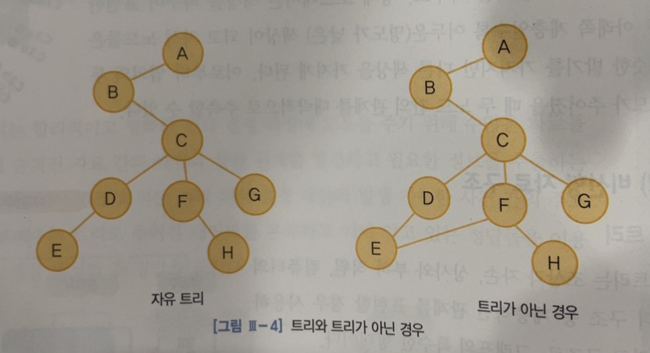</center>

- 오른쪽 그림의 경우 `사이클(Cycle)`을 가지므로 트리가 아니다
***

## 트리의 용어
|용어|설명|ex|
:---:|:---:|:---:
노드(node)|트리의 기본 요소로 정점을 의미|A, B, C, ...,L, M
차수(degree)|파생된 직계 노드의 수|A:2, B:3, I:0
트리의 차수 | 각 노드의 차수 중 최댓값|트리의 차수 : 3
루트(root)노드 | 트리의 맨 꼭대기 노드| A
단말(terminal)노드 | 가지가 없는 노드(차수가 0인 노드) | I, J, K, L, M, E, F
부모(parent)노드 | 자신을 파생시킨 한 레벨 위의 노드 | I, J의 부모 노드: D
자식(child)노드 | 자신이 파생시킨 한 레벨 아래의 노드 | A의 자식 노드 : B, C
형제(sibling)노드 | 부모 노드가 같은 노드 | B, C 등
레벨(level) | 루트를 레벨1로 가정한 후 자식으로 내려갈수록 1씩 증가|
포레스트(forest) | 분리된 트리 집합|
***
<center>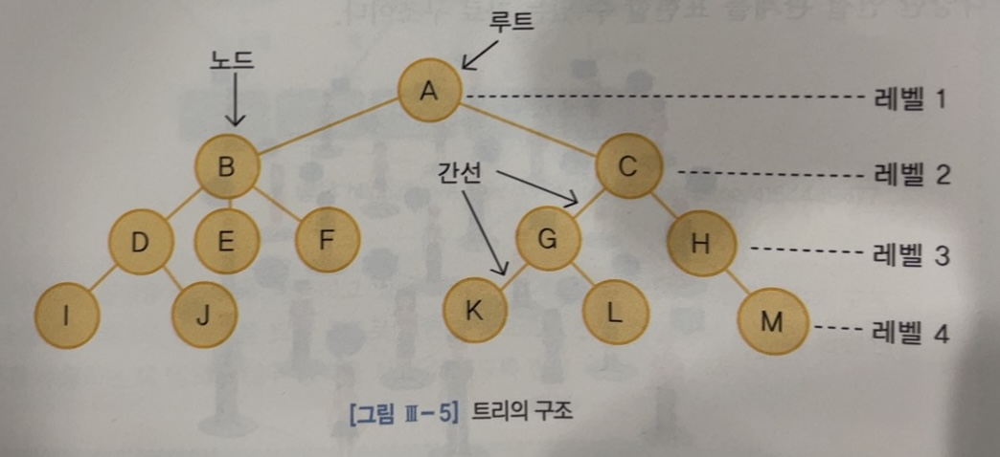</center>

***

## 트리의 분류
- `순서 트리(ordered Tree)` : 위치 상의 의미가 중요한 트리
- `비순서 트리(oriented Tree)` : 위치 상의 의미가 중요하지 않은 트리
<center>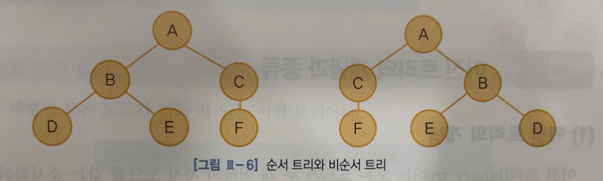</center>

+) 위 그림이 순서 트리라면 두 트리는 다른 트리이고, 비순서 트리이면 두 트리는 같은 트리이다

- `닮은트리(similar tree)` : 두 트리가 주어졌을 때, 트리의 노드 수와 위치 등 그 구조는 같고 노드의 부분만 다른 경우
<center>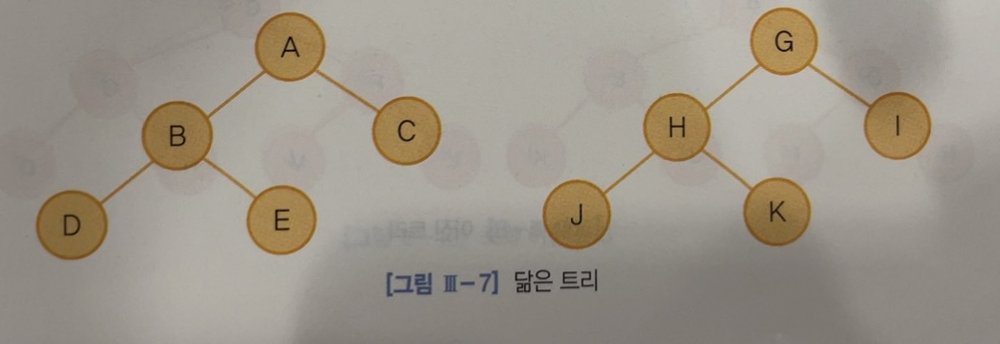</center>

***
# 이진 트리(Binary Tree)
- 모든 노드가 *두 개 이하*의 자식 노드를 갖는 순서화 된 트리
<center>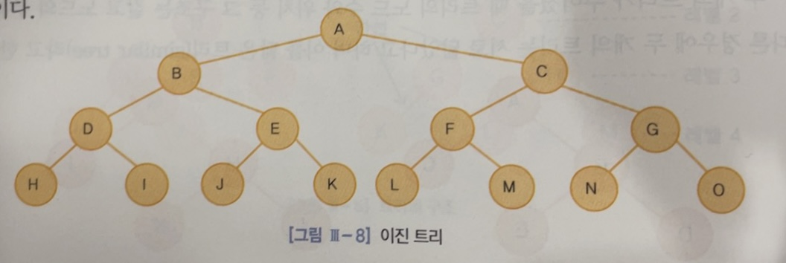</center>

- 이진 트리는 순서 트리이기 때문에 다음 두 이진 트리는 서로 다른 트리
<center>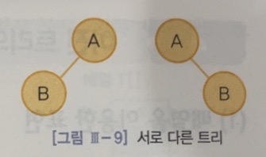</center>

***
## 이진 트리의 종류
- `사향 이진 트리` : 루트를 제외한 모든 노드가 그 부모의 왼쪽 또는 오른쪽 자식인 이진 트리
<center>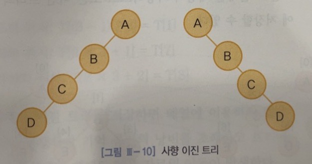</center>

- `완전 이진 트리` : 임의의 두 단말 노드의 레벨 차이가 1이하이며, 왼쪽에서 오른쪽으로 채워진 이진 트리<br>
전체 노드 수 : `2^(n-1) - 1` < `전체 노드 수` < `(2^n) - 1`
<center>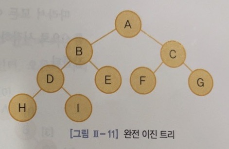</center>

***
## 이진 트리의 표현
### 배열을 이용한 표현
- `포화 이진 트리`는 루트를 정수 0부터 시작하여 레벨이 증가하는 방향으로 같은 레벨에서는 왼쪽 노드에서 오른쪽 노드로 차례대로 정수를 각 노드의 번호로 부여할 수 있다
- 트리의 깊이가 `k`일 때, 배열의 공간은 `(2^k) -1`만큼이 필요하다
<center>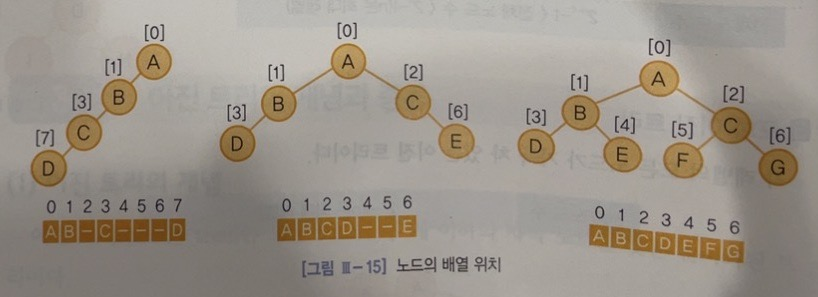</center>

- 이진 트리를 배열 `T[]`에 저장할 때, 임의의 배열 원소 `T[i]`의 부모 노드, 왼쪽 자식 노드, 오른쪽 자식 노드의 위치를 찾는 함수는 다음과 같다<br>
```
1. 부모 노드의 위치 : (i - 1) / 2       // (i != 0)
2. 왼쪽 자식의 위치 : 2i + 1
3. 오른쪽 자식의 위치 : 2i + 2
```
- 완전 이진 트리를 배열 `T[]`에 저장 했을 경우, `T[3]`의 부모 노드, 왼쪽 자식 노드, 오른쪽 자식 노드의 위치는 다음과 같다
<center>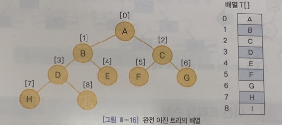</center>

- 부모 노드 : `T[(3-1) / 2]` == `T[1]`
- 왼쪽 자식 노드 : `T[(2*3) + 1]` == `T[7]`
- 오른쪽 자식 노드 : `T[(2*3) + 2]` == `T[8]`
<br><br>
+) 배열을 이용해서 이진 트리를 저장하면 기억 공간의 낭비를 초래하고 트리에 노드를 삽입, 삭제 시 많은 자료의 이동이 발생한다

***
### 연결 리스트를 이용한 표현
- 연결 리스트는 트리를 배열로 저장할 때 발생하는 문제를 해결할 수 있으며 `노드를 저장할 자료`, `왼쪽 자식 노드에 대한 포인터
`, `오른쪽 자식 노드에 대한 포인터`의 요소를 갖는 구조체를 갖는다
```c
typedef struct TreeNode{
    int data;
    struct TreeNode *left_child;
    struct TreeNode *right_child;
}TreeNode;

TreeNode node;
```
<center>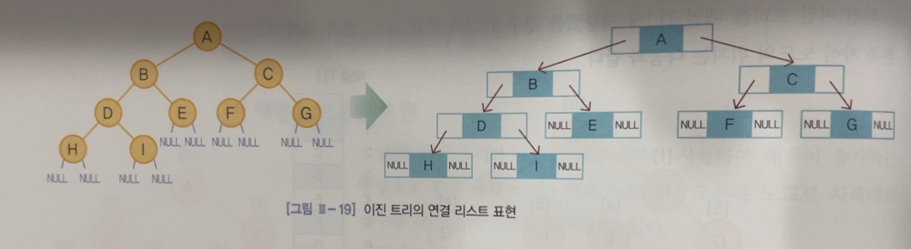</center>

***
## 이진 트리의 순회(Traversal)
- 이진 트리의 순회(Traversal)란 트리 내의 각 노드를 한 번씩만 방문하여 저장된 정보를 확인하는 것
- 이진 트리의 순회 방법 :
    - 중위 순회(inorder)
    - 전위 순회(preorder)
    - 후위 순회(postorder)
***
### 전위(Preorder)순회
- `루트 노드`를 먼저 방문한 다음 `왼쪽 서브 트리`를 방문하고 마지막으로 `오른쪽 서브 트리`를 방문한다
<center>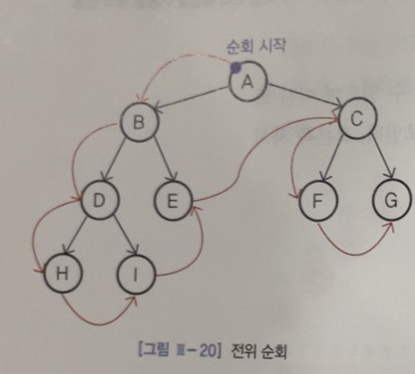</center>

### 중위(Inorder)순회
- `왼쪽 서브 트리`를 먼저 방문한 다음 `루트 노드`를 방문하고 마지막으로 `오른쪽 서브 트리`를 방문한다
<center>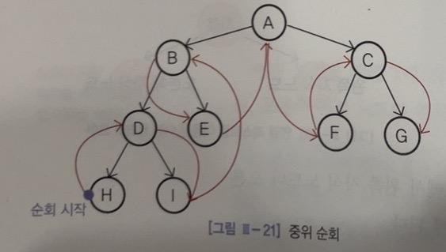</center>

### 후위(Postorder)
- `왼쪽 서브 트리`를 먼저 방문한 다음 `오른쪽 서브 트리`를 방문하고 마지막으로 `루트 노드`를 방문한다
<center>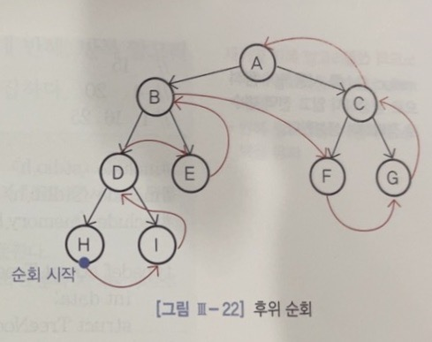</center>

## 이진 트리 순회 알고리즘
- 시스템 스택을 사용하는 `순환(recursive) 알고리즘`과 사용자가 스택을 유지하는 `반복(ierative) 알고리즘`을 사용하여 구현할 수 있다
***
### 재귀 알고리즘을 사용한 이진 트리 순회
```c
//      15
//  4       20
//1       16  25
#include <stdio.h>
#include <stdlib.h>
#include <memory.h>

typedef struct TreeNode{
    int data;
    struct TreeNode *left, *right;
}TreeNode;

TreeNode n1 = {1, NULL, NULL};
TreeNode n2 = {4, &n1, NULL};
TreeNode n3 = {16, NULL, NULL};
TreeNode n4 = {25, NULL, NULL};
TreeNode n5 = {20, &n3, &n4};
TreeNode n6 = {15, &n2, &n5};
TreeNode *root = &n6;

void inorder(TreeNode * root){
    if(root){
        inorder(root -> left);
        printf("%d", root -> data);
        inorder(root -> right);
    }
}

void preorder(TreeNode * root){
    if(root){
        printf("%d", root -> data);
        preorder(root -> left);
        preorder(root -> right);
    }
}

void postorder(TreeNode * root){
    if(root){
        postorder(root -> left);
        postorder(root -> right);
        printf("%d", root -> data);
    }
}

int main(){
    inorder(root);
    preorder(root);
    postorder(root);

    return 0;
}
```
***
### 반복 알고리즘을 사용한 이진 트리 순회
- 중위 순회
    1. 루트 노드에서 단말 노드를 만날 때까지 가장 왼쪽 경로를 따라 내려가면서 노드들을 스택에 넣는다
    2. 단말 노드를 만나면 스택에서 `top`에 있는 노드를 하나 꺼내어 방문한다<br>
    이때 스택이 비어있으면 종료한다. 그렇지 않으면 방문한 노드의 오른쪽 자식을 루트로 하는 트리에 대하여 `i`의 과정을 반복한다
- 전위 순회
    1. 루트 노드에서 단말 노드를 만날 때까지 가장 왼쪽 경로를 따라 내려가면서 노드들을 방문하고, 방문된 노드의 오른쪽 자식이 단말 노드가 아니면 그 오른쪽 자식을 스택에 넣는다
    2. 스택에서 `top`에 있는 노드를 하나 꺼내고, 이 노드를 루트로 하여 `i`의 과정부터 다시 반복한다. 이때 스택이 비어있게 되면 종료한다
- 후위 순회
    1. 루트 노드에서 단말 노드를 만날때까지 가장 왼쪽 경로를 따라 내려가면서 경로상에 있는 노드와 그 노드의 단말 노드가 아닌 오른쪽 자식 노드를 스택에 삽입한다.<br>
    스택에 삽입되는 노드가 왼쪽 자식인지 오른쪽 자식인지를 구별할 수 있는 정보도 같이 유지한다
    2. 스택의 `top`에 있는 노드를 계속 삭제한다. 이때 삭제된 노드가 왼쪽 자식이면 그 노드를 방문한 다음 계속 `top`에 있는 원소를 삭제하고, 오른쪽 자식이면 삭제 과정을 중단하고 이 노드를 루트로 하여 `i`의 과정부터 다시 반복한다. 만약 스택이 비어있게 되면 종료한다
***
## 이진 탐색 트리(Binary Search Tree)
- 정의 : 
    1. 모든 노드는 서로 다른 유일한 값을 갖는다
    1. 왼쪽 서브 트리에 있는 노드들의 값은 루트의 값보다 작다
    1. 오른쪽 서브 트리에 있는 노드들의 값은 루트의 값보다 크다
    1. 왼쪽 서브트리와 오른쪽 서브트리도 이진 탐색 트리다
***
### 이진 탐색 트리의 탐색
- 이진 탐색 트리는 `왼쪽 자식 노드` < `루트 노드` < `오른쪽 자식 노드`의 관계가 형성되기 때문에 `중위순회(inorder)`를 하게 되면 오름차순으로 정렬된 값을 얻을 수 있다

- ex)
- 노드 값 `x`를 찾기 위한 이진 탐색 트리는 `루트 노드`에서부터 시작하여
    1. `x` = `루트 노드 값` :
        - 노드를 찾았으므로 탐색 종료
    1. `x` < `루트 노드 값` :
        - 루트 노드의 왼쪽 서브트리에 대하여 이진 탐색 트리의 탐색
    1. `x` > `루트 노드 값` :
        - 루트 노드의 오른쪽 서브트리에 대하여 이진 탐색 트리의 탐색

```c
Node *BST(Node *Tree, int findData){
    if(Tree == NULL)
        return NULL;
    if(Tree -> data == findData)    // 데이터를 찾았다면, 해당 노드의 주소를 반환
        return Tree;
    
    // 찾는 데이터가 현재 노드의 데이터보다 작다면, 왼쪽 서브 트리에서 탐색을 다시 시작
    else if(Tree -> data > findData)
        BST(Tree -> left, findData);
    
    // 찾는 데이터가 현재 노드의 데이터보다 크다면, 오른쪽 서브 트리에서 탐색을 다시 시작
    else
        BST(Tree -> right, findData);
}
```
***
### 이진 탐색 트리에서의 삽입
- 삽입 시에는 먼저 동일한 원소가 트리 내에 있는지 확인하는 과정이 필요하다<br>
만약 동일한 원소가 없다면, 탐색이 실패하여 종료된 그 지점에 새로운 노드를 삽입한다
<center>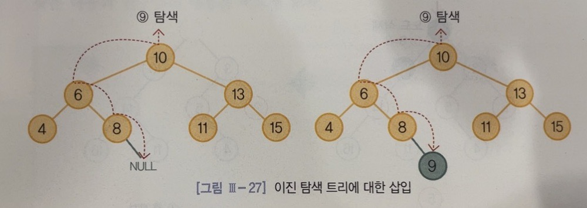</center>

***
### 이진 탐색 트리에서의 삭제
1. 삭제할 노드가 단말 노드인 경우
    - 탐색을 통해 삭제할 노드의 위치를 찾은 후, 그 노드를 삭제하고 부모 노드의 해당 자식 노드의 링크를 NULL로 설정한다

<center>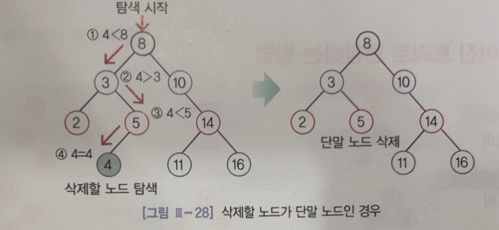</center>

2. 삭제할 노드가 하나의 자식 노드를 가진 경우
    - 해당 노드를 삭제하고 삭제한 노드의 자식 노드를 삭제한 노드의 위치에 이동한다
<center>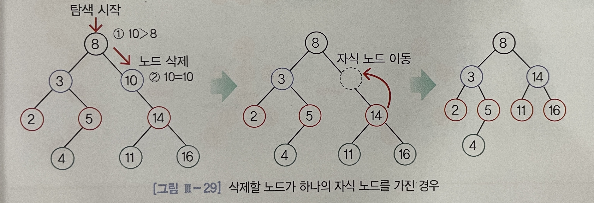</center>

3. 삭제할 노드가 두 개의 자식 노드를 가진 경우
    - 해당 노드를 삭제한 후 삭제한 노드의 왼쪽 서브 트리에서 가장 값이 큰 노드나, 또는 오른쪽 서브 트리에서 가장 값이 작은 노드를 삭제한 노드의 위치로 이동한다
<center>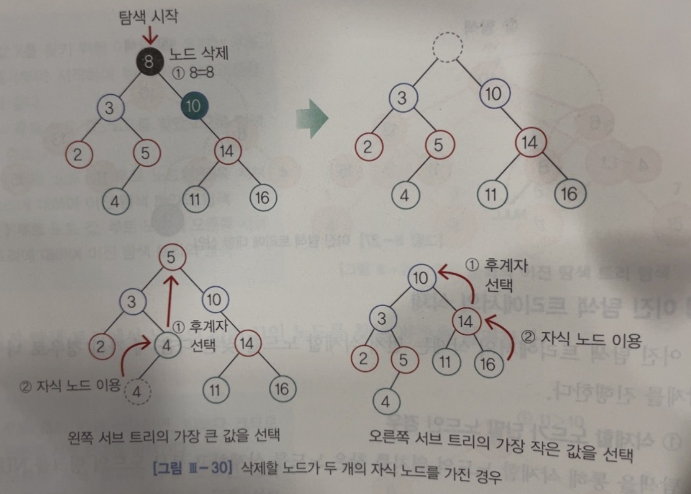</center>