<!--
1. 이미지(가운데 정렬, 60%)
<p align = "center"></p>
<p align = "center">
내용
</p>
-->
# 비선형 구조 - 그래프(Graph)
## Contents
 1. [그래프(Graph)?](#그래프graph)
    - [그래프의 종류](#그래프의-종류)
    - [간선의 특성에 따른 분류](#간선의-특성에-따른-분류)
    - [구조적 특성에 따른 분류](#구조적-특성에-따른-분류)
 1. [그래프의 용어](#그래프의-용어)
 1. [그래프의 표현](#그래프의-표현)
    - [인접 행렬을 이용한 표현](#인접-행렬을-이용한-표현)
    - [인접 리스트를 이용한 표현](#인접-리스트를-이용한-표현)
1. [그래프의 탐색](#그래프의-탐색)
    - [깊이 우선 탐색(DFS, Depth First Search)](#깊이-우선-탐색dfs-depth-first-search)
    - [너비 우선 탐색(BFS, Breadth First Search)](#너비-우선-탐색bfs-breadth-first-search)
***
# 그래프(Graph)?
- 연결되어 있는 객체 간의 다양한 관계를 표현할 수 있는 자료 구조
- 여러가지 특성을 가질 수 있는 정점(vertex)과 정점들 간의 관계를 의미하는 간선(edge)들의 집합으로 구성된다
<p align = "center">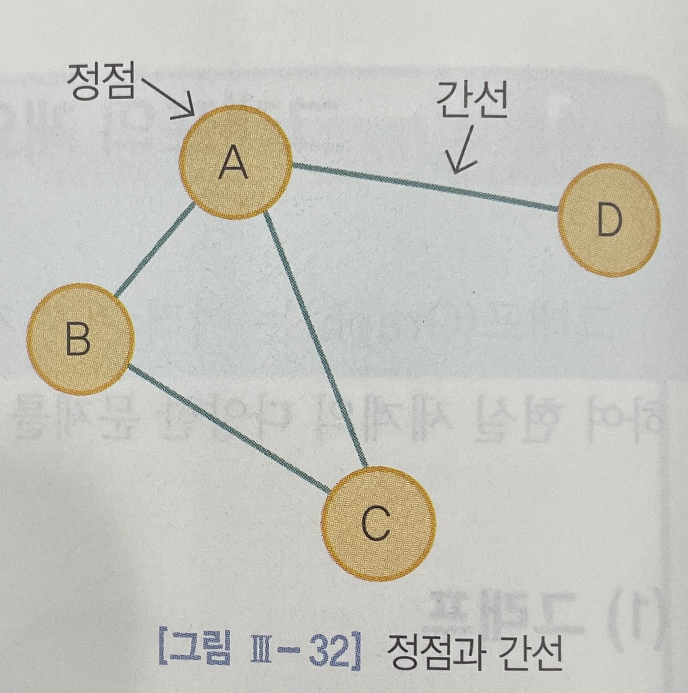</p>

- 참고)
<p align = "center">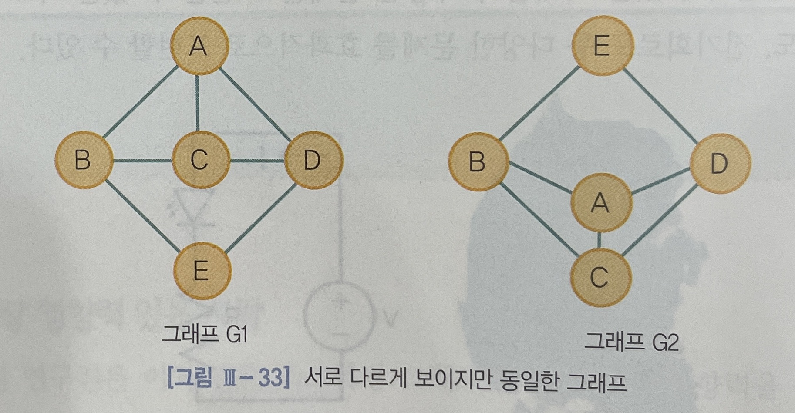</p>

***
## 그래프의 종류
- 그래프는 간선의 방향성, 간선의 가중치 그래프의 구조적 특성에 따라 다양한 종류로 구분할 수 있다

    1. 간선의 특성에 따른 분류
        - 무방향 그래프와 방향 그래프
        - 가중치 그래프
    1. 구조적 특성에 따른 분류
        - 완전 그래프
        - 부분 그래프
***
## 간선의 특성에 따른 분류
1. 무방향 그래프와 방향 그래프
    - 그래프는 간선의 방향성에 따라 방향이 없는 `무방향 그래프(undirected grpah)`와 방향을 가지고 있는 `방향 그래프(directed graph)`로 구성된다
<p align = "center">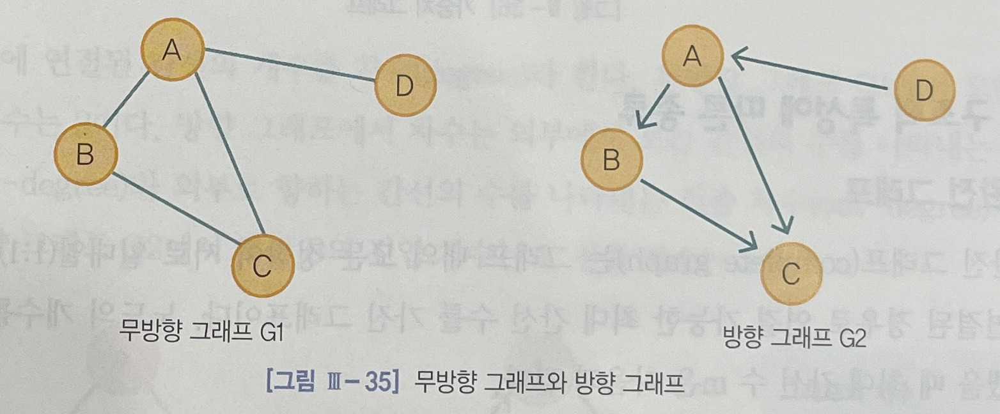</p>

- `무방향 그래프`는 `정점 A`와 `정점 B`를 연결하는 간선을 `(A, B)`와 같이 정점의 쌍으로 표시한다
- `방향 그래프`는 `정점 A`에서 `정점 B`로만 갈 수 있는 간선을 `<A, B>`로 표시한다

그래프 | 구분 | 집합
:---:|:---:|:---:
G1| 정점|V(G1) = {A, B, C, D}
||간선|E(G1) = {(A, B), (A, C), (A, D), (B, C)}
G2|정점|V(G2) = {A, B, C, D}
||간선|E(G2) = {<A, B>, <A, C>, <B, C>, <D, A>}
***
2. 가중치 그래프
    - 간선에 정점 간의 가중치를 나타내는 그래프를 가중치 그래프(Weighted graph)라고 한다
<p align = "center">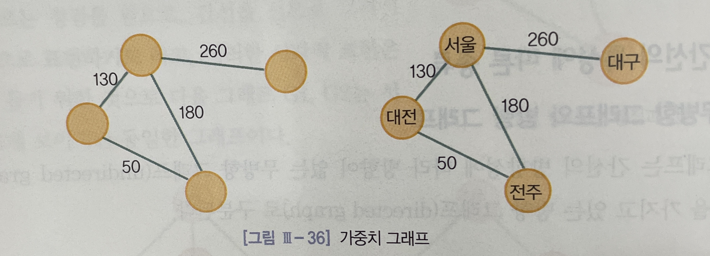</p>

***
## 구조적 특성에 따른 분류
1. 완전 그래프(Complete graph)
    - 완전 그래프(Complete graph)는 그래프 내의 모든 정점이 서로 일대일(1:1) 간선으로 연결된 경우로, 연결 가능한 최대 간선 수를 가진 그래프이다
<br>
<br>

    그래프의 종류 | 최대 간선 수
    :---: | :---:
    무방향 그래프|m = n(n-1)/2
    방향 그래프|m = n(n-1)
***
1. 부분 그래프(Subgraph)
    - 그래프를 구성하는 정점의 집합과 간선의 집합의 부분 집합으로 이루어진 그래프를 말한다

<p align = "center">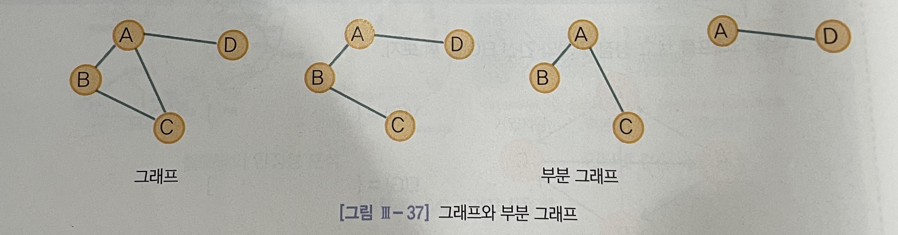</p>

***
# 그래프의 용어
- `인접(adjacent)` :
두 개의 정점을 연결하는 간선이 존재하는 경우 두 정점은 인접한다고 한다
- `차수(degree)` : 
정점에 연결된 간선의 개수를 차수라 한다<br>
단, 방향 그래프에서 차수는 아래 두가지로 구분된다<br>
`진입차수(in-degree)` : 외부에서 오는 간선의 수<br>
`진출차수(out-degree)` : 외부로 향하는 간선의 수를 나타냄
<p align = "center">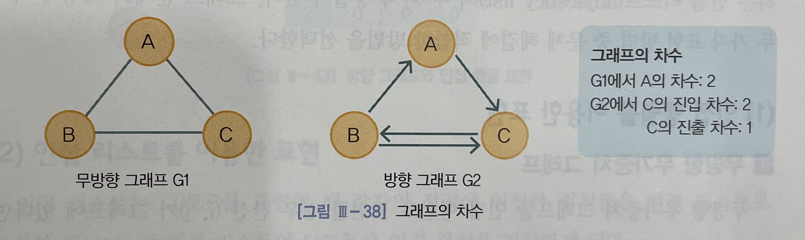</p>

- `경로(path)` : 
두 `정점 A`에서 `정점 B`까지의 경로는 `정점 A`에서 `정점 B`에 이르는 간선들의 인접 노드를 순서대로 나열한 리스트를 말한다
<p align = "center">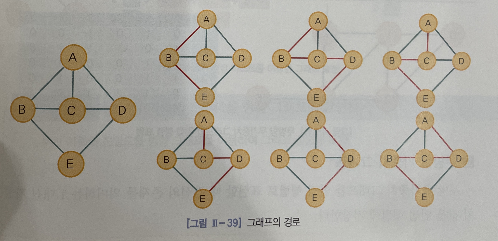</p>

- `루프(loop)` : 
임의의 한 정점이 자기 자신으로 이어지는 간선을 가지고 있는 경우를 루프라고 한다
***

# 그래프의 표현
- 그래프를 표현하는 방법으로는 `인접 행렬(adjacency matrix)`과 연결 리스트를 사용하는 `인접 리스트(adjacency list)`의 두 가지 방법이 있다

## 인접 행렬을 이용한 표현
1. 무방향 무가중치 그래프
```c
간선(i, j)가 그래프에 있다면 M[i][j] = 1, M[j][i] = 1
간선(i, j)가 그래프에 없다면 M[i][j] = 0, M[j][i] = 0
```
<p align = "center">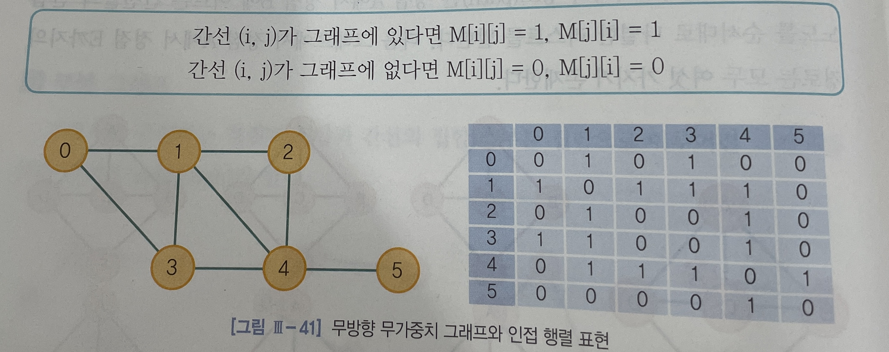</p>

2. 무방향 가중치 그래프
    - 간선의 존재를 의미하는 `1` 대신 가중치 값을 인접 행렬에 저장한다
<p align = "center">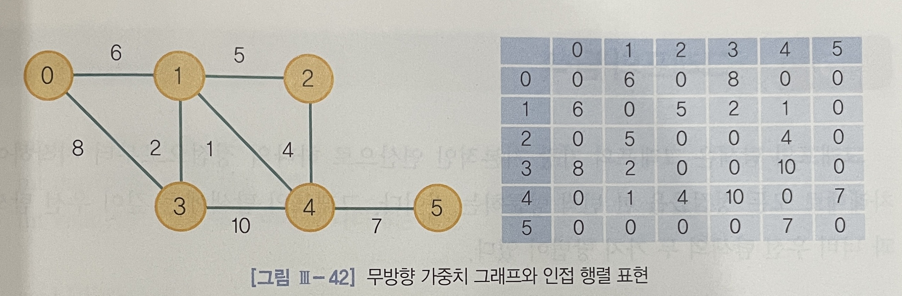</p>

3. 방향 그래프
```c
간선 <i, j>가 그래프에 존재하면, 행렬[i][j]값은 1이며,
간선 <i, j>가 존재하지 않으면, 행렬[i][j]값은 0이다.
```
<p align = "center">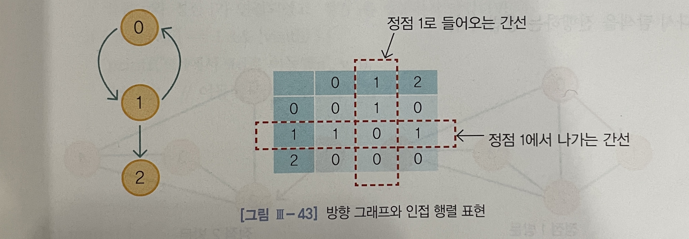</p>

***
## 인접 리스트를 이용한 표현
- 인접 리스트는 그래프를 표현할 때 각각의 정점에 인접한 정점들을 연결 리스트로 표현한 것이다<br>
각 연결 리스트의 노드들은 인접 정점을 저장하게 된다

<p align = "center">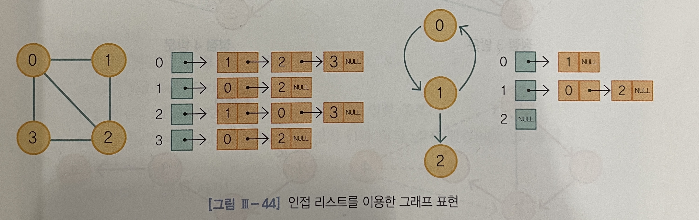</p>

- 참고)
```c
typedef struct listNode{
    int vertex;
    struct listNode *link;
};
```
- 연결 리스트 구조체를 만들어 활용한다
***
# 그래프의 탐색
- 그래프의 탐색은 그래프의 가장 기본적인 연산으로, 하나의 정점으로부터 시작하여 차례대로 모든 정점들을 한 번씩 방문하는 것이다
## 깊이 우선 탐색(DFS, Depth First Search)
- `DFS`는 시작 정점으로부터 한 방향으로 갈 수 있을 때까지 계속 가다가 더 이상 갈 수 없게 될 때 다시 가장 가까운 곳으로 연결하여 이곳으로부터 다른 방향으로 다시 탐색을 진행하는 방법이다
<p align = "center">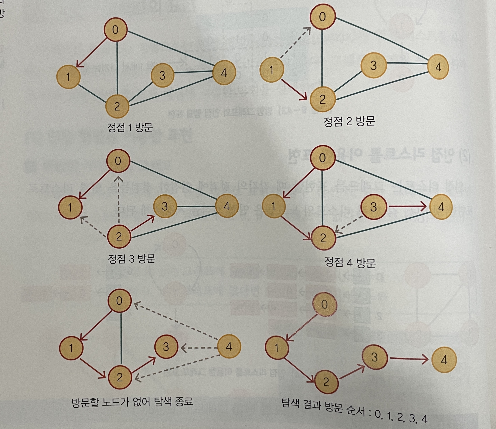</p>

- `DFS`는 그래프의 모든 간선을 조사하므로 정점의 수가 `n`이다
간선의 수가 `e`인 그래프를 깊이 우선 탐색하는 시간은 그래프가 인접 리스트로 표현되어 있다면 `O(n+e)`이고, 인접 행렬로 표현되어 있다면 `O(n^2)`로써 인접 리스트의 사용이 인접 행렬의 사용보다 시간적으로 유리하다
***
```c
#include <stdio.h>

int n;               // 정점의 총 개수
int map[30][30];    // 인접 행렬
int visit[30];      // 방문 여부를 나타내는 배열

void DFS(int v){
    visit[v] = 1;       // 정점 v를 방문했다고 표시

    for (int i = 1; i <= n; i++){
        // 정점 v와 정점 i가 연결되었고, 정점 i를 방문하지 않았다면
        if(map[v][i] == 1 && !visit[i]){
            printf("%d에서 %d로 이동\n", v, i);
            DFS(i);         // 이동 된 정점 i에서 다시 탐색
        }
    }
}

int main(){
    int start;          // 시작 정점
    int v1, v2;

    printf("정점의 총 개수와 시작 정점을 입력하세요 : 
    ");
    scanf("%d %d", &n, &start);

    while(1){
        printf("연결할 두 정점을 입력하세요(ex : 3 4) : ");
        scanf("%d %d", &v1, &v2);

        if(v1 == -1 && v2 == -1)
            break;
        map[v1][v2] = map[v2][v1] = 1;      // 정점 v1과 정점 v2가 연결되었다고 표시
    }

    DFS(start);         // DFS 시작

    return 0;
}
```
***
## 너비 우선 탐색(BFS, Breadth First Search)
- BFS는 시작 정점으로부터 가까운 정점을 모두 방문하고 멀리 떨어져 있는 정점을 나중에 방문하는 탐색 방법이다
<p align = "center">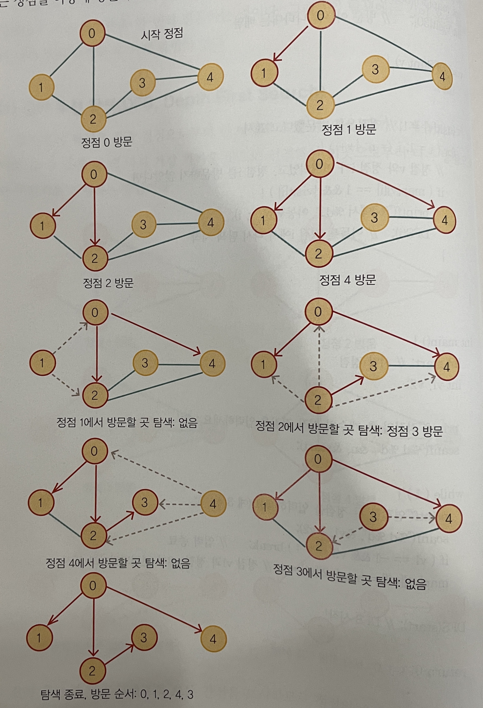</p>

- `BFS`는 인접 리스트로 표현되어 있다면 전체 수행 시간이 `O(n+e)`이며, 인접 행렬로 표현되어 있는 경우는 `O(n^2)`이다
따라서 `BFS`도 인접 리스트를 사용하는 것이 인접 행렬을 사용하는 것보다 효율적이다
***
```c
#include <stdio.h>

int n;                  // 정점의 최댓값
int rear, front;        // 앞, 뒤 쪽을 나타내는 변수
int map[30][30];        // 인접 행렬
int queue[30];          // 큐 
int visit[30];          // 방문 여부를 나타내는 배열

void BFS(int v){
    visit[v] = 1;
    printf("%d에서 시작\n", v);
    queue[rear++] = v;      // 큐에 v를 삽입하고 뒤쪽을 1 증가 시킴

    while(front < rear){        // 뒤 쪽이 앞 쪽과 같거나 작으면 루프 탈출
    // 큐의 첫 번째에 있는 데이터를 제외하고 제외된 값을 가져오며, 앞쪽 1 증가
        v = queue[front++];
        for(int i = 1; i <= n; i++){
            //정점 v와 정점 i가 만나고, 정점 i를 방문하지 않은 상태일 경우
            if(map[v][i] == 1 && !visit[i]){
                visit[i] == 1;          // 정점 i를 방문했다고 표시
                printf("%d에서 %d로 이동\n", v, i);
                queue[rear++] = i;          // 큐에 i를 삽입하고 후단을 1 증가시킴
            }
        } 
    }
}

int main(){
    int start;      // 시작 정점
    int v1, v2;

    printf("정점의 총 개수와 시작 정점을 입력하세요 : 
    ");
    scanf("%d %d", &n, &start);

    while(1){
        printf("연결할 두 정점을 입력하세요(ex : 3 4) : ");
        scanf("%d %d", &v1, &v2);

        if(v1 == -1 && v2 == -1)
            break;
        map[v1][v2] = map[v2][v1] = 1;      // 정점 v1과 정점 v2가 연결되었다고 표시
    }

    BFS(start);         // DFS 시작

    return 0;
}
```
***