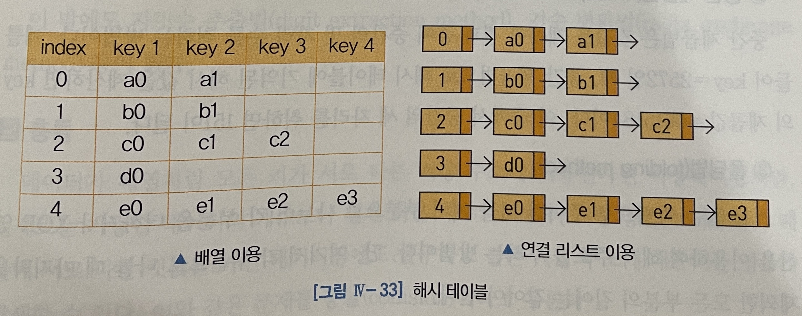
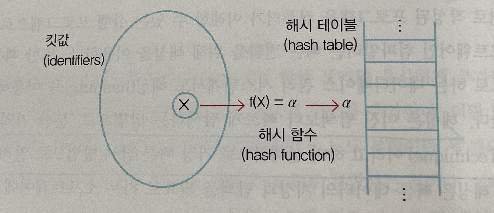

<!--
1. 이미지(가운데 정렬, 60%)
<p align = "center"></p>
<p align = "center">
내용
</p>
-->
# 해싱(Hashing)
## Contents
1. [해싱](#해싱)
    - [해시 함수](#해시-함수)
    - [충돌(Collision)](#충돌collision)
2. [구현](#구현)
***
# 해싱
- 해싱은 이진 탐색보다 빠르게 탐색하는 방법으로 `분산 기억법(Scatter Storage Technique)`이라고 하며 실제적으로 가장 빠른 탐색 방법으로 알려져 있다
- 해싱은 데이터의 킷값을 이용해서 데이터의 저장 장소를 계산하고, 이를 이용해서 데이터를 저장, 탐색하는 방법이다

- ex) <br>
배열 `T[1..n]`에는 인덱스(첨자)를 킷 값으로 갖는 데이터가 저장된다고 가정한다
즉, `T[i]`에 킷값 i(1 <= i <= n)을 갖는 데이터가 저장됨<br>
이와 같은 형태로 데이터가 저장된다면 모든 데이터는 단 한번에 바로 접근할 수 있다
<p align = "center"></p>
<p align = "center">
해시 테이블
</p>

- `해시 테이블(Hash table)` : 해싱에 의해 데이터를 저장하는 공간
- `해시 함수(Hash function)` : 데이터 값을 이용해서 저장 위치를 정하는 연산
***
## 해시 함수
- 키-주소 매핑을 위한 해시 함수로는 다양한 방법들이 사용된다
- 가장 간단한 형태로는 직접적인 해싱 방법, 즉 킷값에 대해서 어떤 처리도 거치지 않고 바로 주소로 사용하는 방법이다
<br>-> `충돌`이 발생하지 않는다면 어떤 해시 함수보다 우수하고 이상적인 방법이다
<p align = "center"></p>
<p align = "center">
해시 함수
</p>

- 예를 들어 주민등록번호를 킷값으로 하는 데이터에 대해서 직접적인 해시 함수를 생각해보면 10^13개 만큼의 공간이 필요하다
***
1. `계산 잔여법(division remainder hashing, modulo division)`
    - 킷 값을 저장 공간의 크기로 나누어서 발생하는 나머지를 저장 공간의 주소로 사용하는 방법이다. 저장 공간의 크기를 m 이라고 하면 킷값을 이용한 주소는 다음과 같다
    ```
    주소 = 킷값 mod m
    ```
    - ex) 저장 공간의 크기가 11이고, 킷값이 108이면 주소는 9 (= 108 mod 11)가 된다

2. `중간 제곱법(midsquare method)`
    - 중간 제곱법은 킷값을 제곱한 결과 중에 중간의 몇 자리 수를 취하는 방법이다
    ```c
    key = 2572
    key^2 = 6615184
    new_key = 151
    ```

3. `폴딩법(folding method)`
    - 키를 접는 방법으로 주어진 키를 여러 부분으로 나누어 각 부분을 더하거나 `XOR 연산`을 이용하여 해시 주소를 구하는 방법이다
    ```c
    key = 2572
    new_key1 = 2 + 5 + 7 + 2
    new_key2 = 25 + 72가 될 수 있고

    2572를 2진수로 표현하면 
    0010 1000 1101 이므로
    0000 0010과 1000 1101 처럼
    두 부분으로 나눈 뒤
    XOR연산을 실행 하면

    new_key3 = 1000 1111
    ```
- 이 외에도 `자릿수 추출법(digit extraction method)`, `기수 변환법(radix exchange method)`등 이 있다
***
## 충돌
- 데이터가 배열처럼 모든 키가 서로 다른 저장 주소에 대응된다면 이상적이겠지만,<br>실제로는 가능한 데이터의 개수보다 훨씬 작은 개수의 데이터 저장공간을 사용하기 때문에<br> 서로 다른 킷값을 가진 데이터임에도 불구하고 같은 저장 주소에 대응되는 경우를 `충돌(collision)`이라고 한다
***
1. `연쇄법(chaining, linked list resolution)`
    - 여러 개의 데이터가 동일한 주소로 매핑되면 이들 데이터들을 연결 리스트를 사용해서 연결시키는 방법
2. `개방 주소법(open addressing)`
    - 충돌이 발생하면 새로운 데이터가 위치할 수 있는 빈 공간을 찾는 방법으로 `선형 탐사법`, `이차형 탐사`, `이중 해싱`이 있다

    - `선형 탐사법`
      - 충돌이 발생하여 동일한 주소로 해시되는 원소가 있으면 해시 테이블의 이웃한 다음 위치로 차례대로 이동하면서 첫 번재로 만나는 빈 공간에 원소를 저장시키는 방법이다<br>
        이 방법은 구현이 간단하지만 `1차 클러스터링`이라는 문제를 야기한다

    - `이차형 탐사`
        - 빈 공간을 찾기 위해 앞선 위치와 떨어진 거리가 탐사 순서에 2차적인 관계를 갖는 함수를 사용한다<br>
        하지만, 두 개 키의 초기 위치가 동일하다면 2차형 탐사를 사용한 전체 탐사 순서가 같게 되는 `2차 클러스터링`을 초래한다

    - `이중 해싱`
        - 두 번째 이후에 탐사되는 위치가 첫 번째 탐사 위치와 무관하도록 또 다른 해시 함수를 사용해서 두 번째 이후의 탐사 위치를 결정한다<br>
        여기서 주 해시 함수와는 관계없는 값을 계산하는 다른 해시 함수를 사용해야만 첫 번째 탐사 위치와의 독립성을 이룰 수 있다
***
# 구현
1. 배열로 선언된 해시 테이블
```c
#define MAX_CHAR 10
#define TABLE_SIZE 13

typedef struct{
    char key[MAX_CHAR];
    /*other field*/
}element;

element hash_table[TABLE_SIZE];
```

2. 연결 리스트로 선언된 해시 테이블
```c
#define MAX_CHAR 10
#define TABLE_SIZE 13
#define IS_FULL(ptr) (!(ptr))

typedef struct{
    char key[MAX_CHAR];
    /*other field*/
}element;

typedef struct list *list_ptr;
typedef struct list{
    element item;
    list_ptr link;
};
list_ptr hash_table[TABLE_SIZE];
```

3. 해시 함수
```c
int transform(char *key){
    int number = 0;
    while(*key)
        number = number + *key++;
    
    return number;
}

int hash(char *key){
    return(transform(key) % TABLE_SIZE);
}
```

4. 선형 조사법을 이용한 해시 키의 삽입
```c
void linear_insert(element item, element ht[]){
    int i, hash_value;
    hash_value = hash(item.key);
    i = hash_value;
    while(strlen(ht[i].key)){
        if(!strcmp(ht[i].key, item.key)){
            fprintf(stderr, "duplicate entry\n");
            exit(1);
        }
        i = (i + 1) % TABLE_SIZE;
        if(i == hash_value){
            fprintf(stderr, "the table is full\n");
            exit(1);
        }
    }
    ht[i] = item;
}
```

5. 연쇄법을 이용한 해시 키의 삽입
```c
void chain_insert(element item, list_ptr ht[]){
    int hash_value = hash(item.key);
    list_ptr ptr, trail = NULL;
    list_ptr lead = ht[hash_value];
    for(; lead; trail=lead, lead = lead -> link){
        if(!strcmp(lead -> item.key, item.key)){
            fprintf(stderr, "the key is in the table\n");
            exit(1);
        }
    }
    ptr = (list_ptr)malloc(sizeof(list));
    if(IS_FULL(ptr)){
        fprintf(stderr, "the memory is full\n");
        exit(1);
    }
    ptr -> item = item;
    ptr -> link = NULL;
    if(trail)
        trail -> link = ptr;
    else
        ht[hash_value] = ptr;
}
```
***